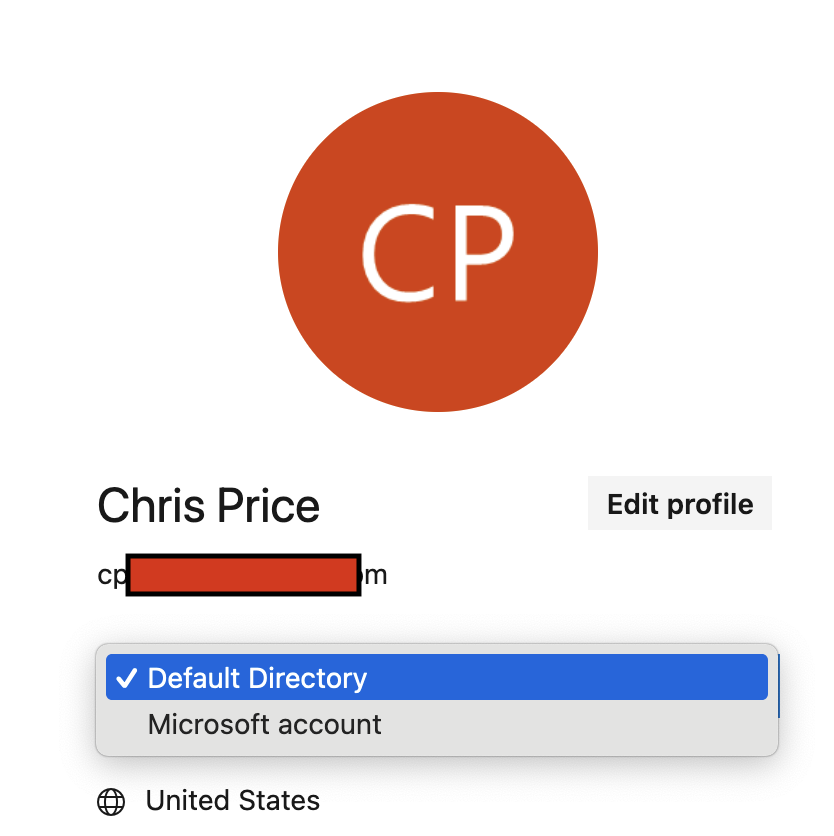
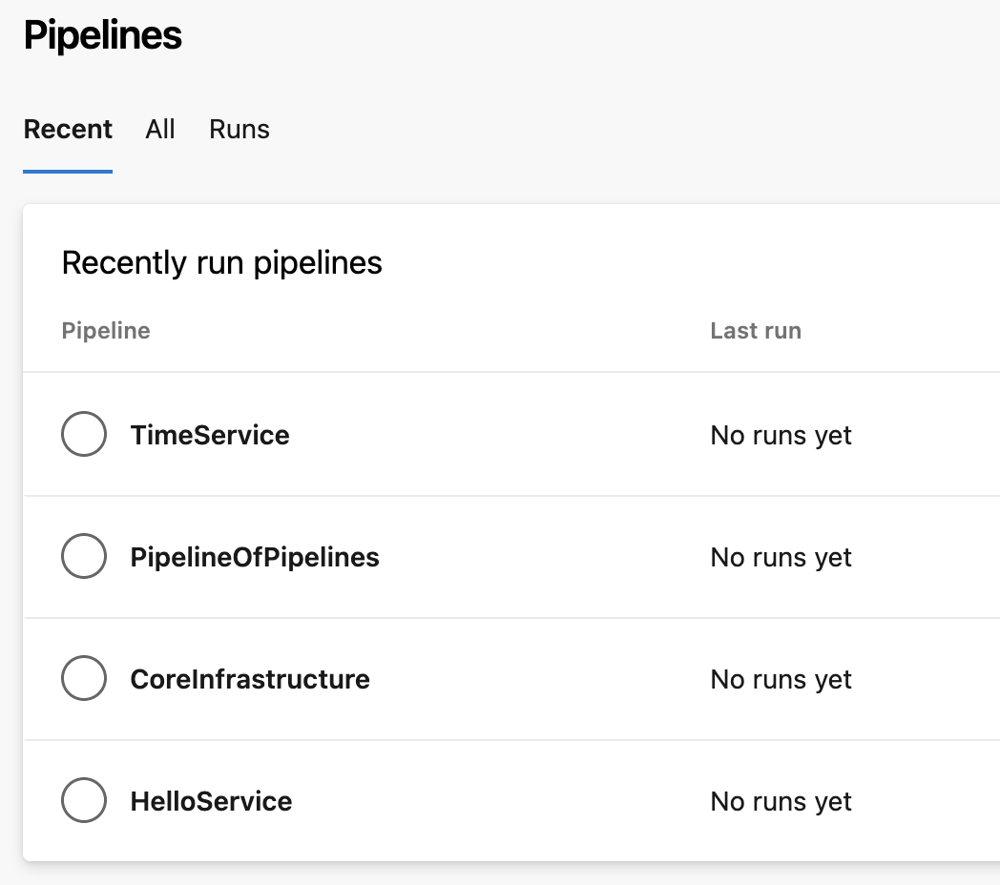
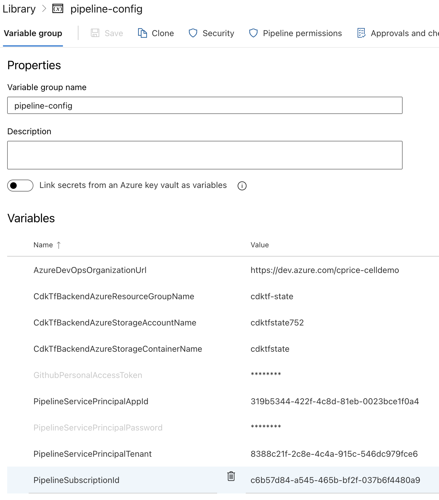
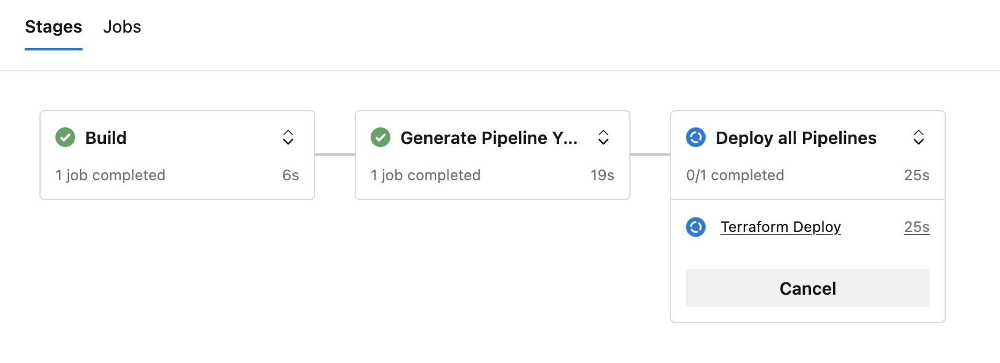
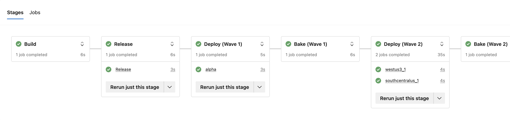

# Azure Cellular Architecture Demo: Pipelines

This directory contains example code to create an Azure Devops project, with pipelines for deploying each of the
application components to all the cells defined in our Cell Registry. It also contains a PipelineOfPipelines, which
iterates over all of the target cells and all of the application components, and keeps the individual application
component pipelines up to date.

Whenever you want to add or remove cells, you can update the Cell Registry and the [CellWaves.cs](https://github.com/cprice404/azure-cellular-demo/blob/main/Pipelines/PipelinesGenerator/CellWaves.cs)
file, then commit your changes, and the PipelineOfPipelines will update all of the other pipelines accordingly.

Whenever you want to add or remove application components, or change the definition of the build/deploy steps that should
be taken for a given pipeline component, you can update the [ApplicationComponents.cs](https://github.com/cprice404/azure-cellular-demo/tree/main/application/Pipelines/PipelinesGenerator/ApplicationComponents.cs)
file, then commit your changes, and the PipelineOfPipelines will update the pipelines accordingly.

NOTE: in this example code, the deployment stages (such as `BuildAndPushAcrImageStage`) are just wired up to use a
`CmdLine@2` azure pipeline task, and echo an informative message about what they would be doing. To actually deploy
the application components, you would modify the stage definitions in [ApplicationComponent.cs](https://github.com/cprice404/azure-cellular-demo/tree/main/application/Pipelines/PipelinesGenerator/ApplicationComponent.cs)
to either add the real CLI commands, or to wire them up to other [Azure Pipeline tasks](https://learn.microsoft.com/en-us/azure/devops/pipelines/tasks/reference/?view=azure-pipelines&viewFallbackFrom=azure-devops).
You can also add any other stages that you like!

# Initial Deployment

To deploy the Azure Devops project for the first time, first you'll need to do the following:

1. Create (or choose) a subscription that you want to use for your DevOps resources.
2. Create a service principal with `Owner` role (or, a lesser-privileged role that will suffice for what you need your
  pipelines to be able to deploy) in that subscription:
  `az ad sp create-for-rbac --name celldemo-devops --role Owner --scopes /subscriptions/<YOUR_SUBSCRIPTION_ID>`
  Make sure you save the appId, password, and tenant.
  ([More Info](https://learn.microsoft.com/en-us/azure/developer/terraform/authenticate-to-azure?tabs=bash#create-a-service-principal`))
3. Create an Azure storage account and container to use for the Terraform state. ([Example](https://learn.microsoft.com/en-us/azure/developer/terraform/store-state-in-azure-storage?tabs=azure-cli#2-configure-remote-state-storage-account))
4. If your source repo is on github (as in this example), you'll need to create a GitHub PAT with `repo` scope. 
5. If you don't have one already, create your azure devops organization.
  
  NOTE: When you are navigating from the Azure portal to Azure DevOps, make sure that you have chosen the Entra Id / Active Directory for
  your Azure tenant, and NOT 'Microsoft Account'; otherwise you won't be able to connect your service principal to your Azure DevOps:
  
  
  
6. In your Azure Devops Org, go to "Organization Settings", then "Users". Click "Add Users" and add the service principal
   that you created in step 2 above. Give it the "Stakeholder" role.
7. In your Azure Devops Org, go to "Organization Settings", then "Security->permissions". Click the "Users" tab, find your
   service principal, click the "Member of" tab, and add them to the "Project Collection Administrators" group.

Almost there!

Now we have all the pieces that we need in order to do our initial CDKTF deployment of the Azure Devops project.
Navigate to the `PipelinesStack` directory and run the following commands:

```bash
cd ./Pipelines/PipelinesStack
cp appsettings.json.EXAMPLE appsettings.json
export ARM_CLIENT_ID=<YOUR_SERVICE_PRINCIPAL_APP_ID>
export ARM_CLIENT_SECRET=<YOUR_SERVICE_PRINCIPAL_PASSWORD>
export ARM_TENANT_ID=<YOUR_SERVICE_PRINCIPAL_TENANT_ID>
export ARM_SUBSCRIPTION_ID=<YOUR_DEVOPS_SUBSCRIPTION_ID>
```

Then, edit the `appsettings.json` file and fill in the required fields:

* `CdkTfBackendAzureResourceGroupName`
* `CdkTfBackendAzureStorageAccountName`
* `CdkTfBackendAzureStorageContainerName`
* `AzureDevopsOrganizationUrl`
* `GithubPersonalAccessToken`

Finally, run the following commands to deploy the Azure Devops project:

```bash
dotnet build
npm run deploy
```

When the cdktf deploy command completes, you should have 4 pipelines in your new Azure Devops project:



Now we need to create a variable group that the pipelines will use for various configuration and auth. From the Pipelines
page, click "Library" in the left nav, then click "+ Variable Group" to add a Variable group. Name the variable group
`pipeline-config`, and add the following variables:

* `AzureDevOpsOrganizationUrl`
* `CdkTfBackendAzureResourceGroupName`
* `CdkTfBackendAzureStorageAccountName`
* `CdkTfBackendAzureStorageContainerName`
* `GithubPersonalAccessToken`
* `PipelineServicePrincipalAppId`
* `PipelineServicePrincipalPassword`
* `PipelineServicePrincipalTenantId`
* `PipelineSubscriptionId`

It should look something like this:



Make sure you click "Save" to save the variable group when you are done.

Finally, we need to authorize the project to access github. Click on the "PipelineOfPipelines" and click on
"Edit", and you should see a prompt to authorize github. Once you have done that, you should see the pipeline
definition (YAML). Click on the Run button to run the PipelineOfPipelines for the first time!

If you get an error message saying that "No hosted parallelism has been purchased or granted", you will need to
either follow the link in the message to request access to the free tier (may take a few days), or you can
increase the "paid parallel jobs" setting under "Organization"->"Billing". (It may take 30 minutes or more for the
paid parallel jobs to become available after you've changed the billing setting.)

When the PipelineOfPipelines runs, it will run `cdktf` to deploy and update the pipelines:



# Trigger the pipelines

Each pipeline is now configured to trigger on a push to the `main` branch, if any files in the corresponding directory
have been modified. For example, try modifying the README in the `application/TimeService` directory and commiting;
you should see the `TimeService` pipeline trigger and run.

# Modify the Application Component Pipelines

When the application component pipelines run, they simulate deploying to all the cells [defined in the cell waves](https://github.com/cprice404/azure-cellular-demo/blob/83061d51ac44e8d8f5e00b6e7b65cf1656bf7926/Pipelines/PipelinesGenerator/CellWaves.cs#L13-L35).



Try removing some cells from a wave, or removing a wave entirely, and commiting the change. When PipelineOfPipelines runs
you should see it update the application component pipelines accordingly.

You can also try modifying the ApplicationComponent pipeline definitions defined in [ApplicationComponents.cs](dhttps://github.com/cprice404/azure-cellular-demo/blob/83061d51ac44e8d8f5e00b6e7b65cf1656bf7926/Pipelines/PipelinesGenerator/ApplicationComponents.cs#L53-L62).
This will allow you to add or remove steps for deployment for a specific application component.

# Note on CDK for Terraform and Azure Devops provider

Some popular Terraform providers, such as the Azure Resource Manager provider, are pre-packaged by Hashicorp. But you can
use just about any Terraform provider, even if they are not pre-packaged. For example, this project uses the `azuredevops`
provider, which does not have pre-built CDKTF packages. Therefore, to use it, we need to `add` and `get` the provider;
e.g. `npx cdktf add azuredevops` and `npx cdktf get`.

When you run those commands, CDKTF will create a `.gen` directory containing generated code for the provider, in whatever
programming language your project is configured to use. In this case, we did this in our C# project. However, the generated
code had a few small quirks that caused compiler warnings. To fix this, we moved the generated code from the `.gen` directory
into the `vendor` directory, so that we could commit it to source control and track small changes to it as needed.