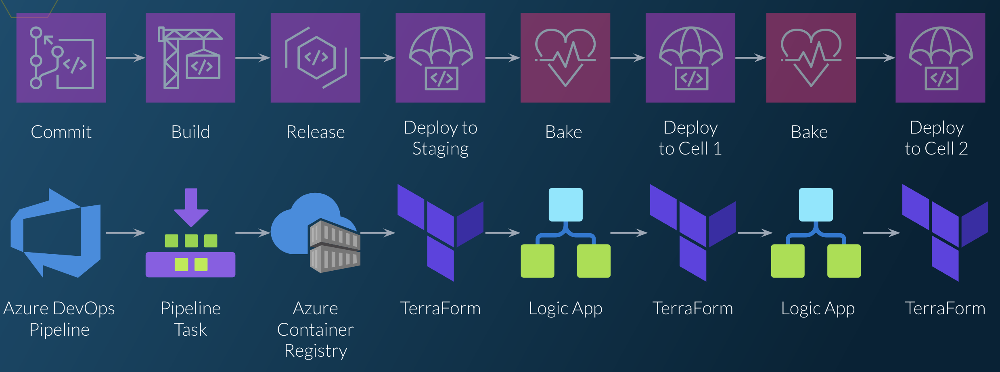

# Azure Cellular Architecture Demo

This repo contains example code to demonstrate one way to build automation for cellular architecture for a simple cloud
application hosted on Azure. It is intended to provide a concrete example of the concepts discussed in my QConSF 2023
talk and article:

https://www.infoq.com/presentations/cellular-architecture/
https://www.infoq.com/articles/high-availability-in-the-cloud-with-cellular-architecture/



The application is comprised of 2 microservices, the `TimeService` and the `HelloService`. The `HelloService` makes a
call to the `TimeService` to get the current time, and then returns a greeting message to the caller. One of the services
is implemented as a Kubernetes deployment and the other as an Azure WebApp, to illustrate how the concepts around
automating cellular deployment can work with services built on different tech stacks.

The infrastructure-as-code components of the application are all built using [CDK for Terraform](https://developer.hashicorp.com/terraform/cdktf)
and written in C#.

The example code contains the following key components (click in to any of the subdirectories for more information about
the specific components):

* `./application` - contains the 3 components that make up the application (though these are probably the least interesting
  parts of the repo):
  * `./application/CoreInfrastructure` - a CDKTF stack that contains common infrastructure to be re-used by other applicaion
    components; e.g. Kubernetes clusters, virtual networks, etc.
  * `./application/TimeService` - code, k8s manifests, and scripts for deploying the `TimeService` to a Kubernetes cluster
  * `./application/HelloService` - a CDKTF stack that deploys the `HelloService` to an Azure WebApp
* `./libraries/CellRegistry` - a C# library that provides a data model defining all the information we need to deploy
  the application to a cell, and to monitor and operate the cell. Includes a hard-coded list of example cells for the demo.
* `./CellBootstrap` - a CLI program for quickly bootstrapping a new cell with the application components, or tearing down
  an existing cell to save costs. This program is intended to be run via the `./cell-bootstrap.sh` or `./cell-teardown.sh`
  scripts in the root directory.
* `./Pipelines` - contains CDKTF code to create and manage an Azure Devops project for the application. The project includes
  a "Pipeline of Pipelines", which is a special "parent" pipeline that is responsible for creating individual pipelines
  to deploy each application component. When cells or application components are added/removed, the "Pipeline of Pipelines"
  will automatically update all the component pipelines to reflect the changes.

# Bootstrapping a new cell

To try out the cell bootstrap script you will need to do the following:

* Create an Azure subscription to use for the cell.
* Log in to the `az` CLI using an owner-level user for the subscription.
* Make sure the correct subscription shows up when you run `az account show`.
* Make sure the `Microsoft.Storage` resource provider is registered for the subscription.
* Create an Azure storage account and container to use for the Terraform state. ([Example](https://learn.microsoft.com/en-us/azure/developer/terraform/store-state-in-azure-storage?tabs=azure-cli#2-configure-remote-state-storage-account))
* Edit the hard-coded cell registry in `./libraries/CellRegistry/CellRegistry/HardCodedCellRegistry.cs` to add an item
  for your new cell. You'll need to add:
  * Your subscription id
  * A cell name (anything you like, but all lowercase and no special chars)
  * Your Azure storage information (resource group, account name, container name)
  * The Azure location (region) you want to deploy to

After this you should be able to run the `./cell-bootstrap.sh` script to deploy the application to your new cell. After
the bootstrap script completes successfully, it make take up to 5 or 10 minutes for the Web App to finish deploying.
Once it has deployed successfully you should be able to make an HTTP request to your HelloService like this:

```
curl http://helloservice-<YOUR_CELL_NAME>.azurewebsites.net
```

If it is not working, navigate to the WebApp in the azure portal and check the logs and deployment logs for the web app.
And feel free to reach out to me and let me know so that I can update the instructions if they are missing something!

# What next?

The cell-bootstrap script allows you to manually bootstrap a single cell, but the more interesting part of this demo is
the pipeline automation. Check out the `./Pipeline` directory for a working example of how to set up Azure Devops pipelines
for each of the application components, so that they can be deployed to multiple cells whenever changes are committed.
